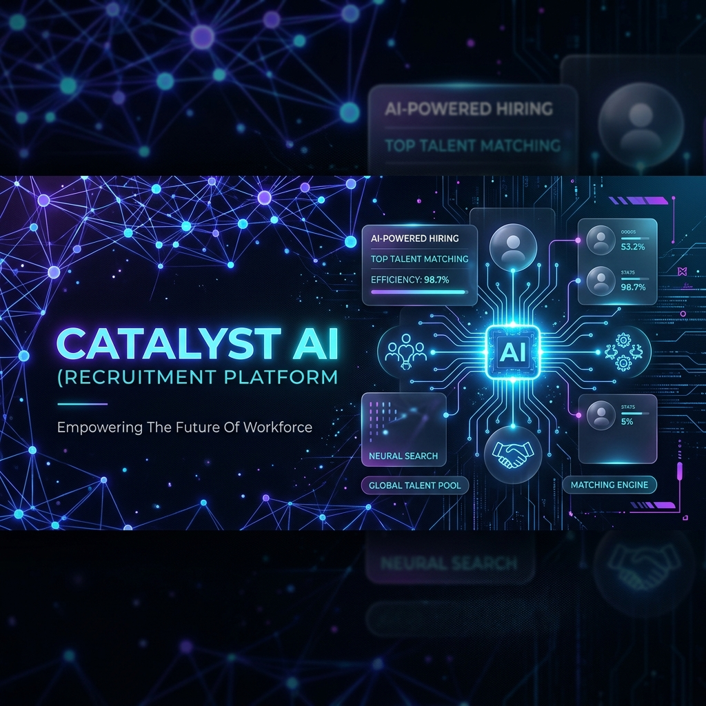
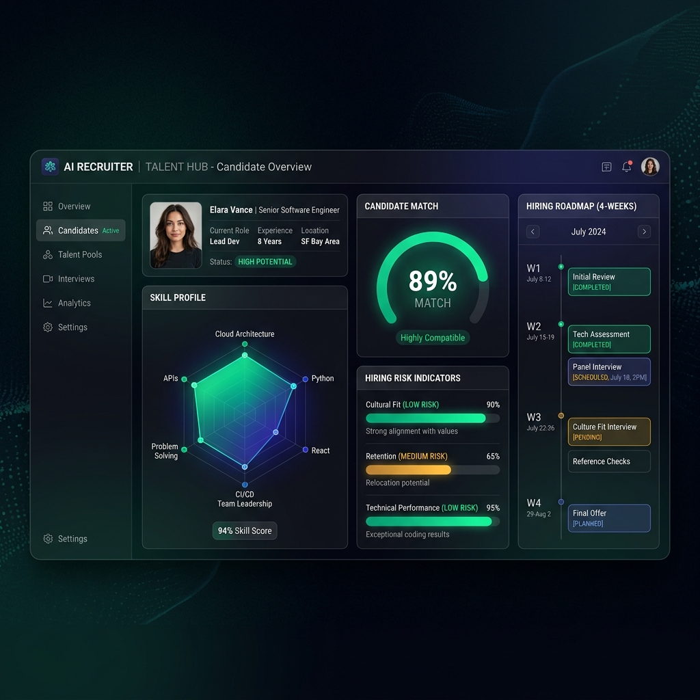
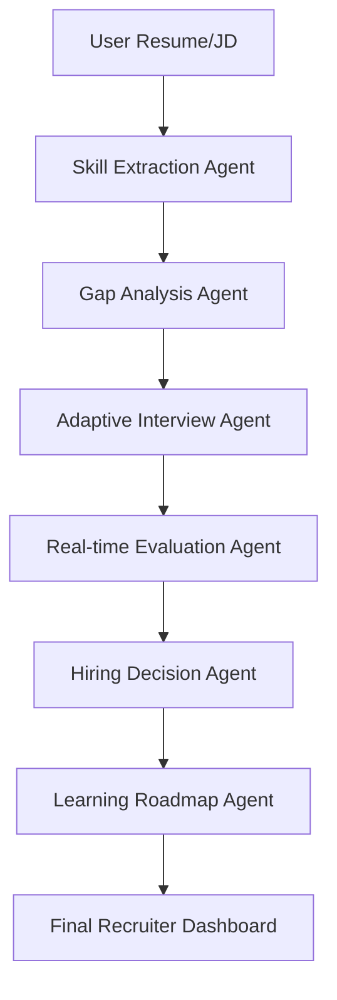

# Catalyst AI: Autonomous Technical Hiring Agent 🧠💼

Catalyst AI is not just a chatbot—it is a **Multi-Agent Technical Assessment Framework** designed to verify real-world engineering proficiency autonomously.

## 🏆 Hackathon Strategy: Core Agentic Behavior
Our system is built on a **Modular Agent Architecture** that handles the end-to-end hiring pipeline:
1. **Extraction Agent**: Deep-parses resumes to extract technical DNA and core competencies.
2. **Matching Agent**: Maps candidate skills against JD requirements to identify high-impact gaps.
3. **Adaptive Interview Agent**: Conducts real-time, difficulty-adjusting technical interviews.
4. **Evaluation Agent**: Analyzes answers with evidence-based scoring (Critical Recruiter Mode).
5. **Decision & Planning Agent**: Generates hiring verdicts, risk indicators, and 4-week roadmaps.

## 🚀 Key Features
- **Adaptive Interviewing**: Questions change in real-time based on the depth of previous answers.
- **Evidence-Based Scoring**: Every score is backed by specific technical details mentioned or missed (✔/✖).
- **Recruiter-Grade Insights**: Includes Confidence Scores, Consistency Metrics, and Hiring Risk indicators.
- **Dynamic Skill Switching**: Assessment focus shifts across tech stacks (JS → React → Node) automatically.

## 🛠️ Tech Stack
- **Framework**: Next.js 15 (App Router)
- **AI Core**: Google Gemini (via optimized reasoning prompts)
- **Styling**: Vanilla CSS + Tailwind (Premium Dark Theme / Glassmorphism)
- **Animations**: Framer Motion (for agentic state transitions)

## 🏗️ Architecture

## 🏃 Running Locally
1. Clone the repo
2. `npm install`
3. Add `GEMINI_API_KEY` to `.env.local`
4. `npm run dev`

Built with ❤️ for Catalyst Hackathon.
